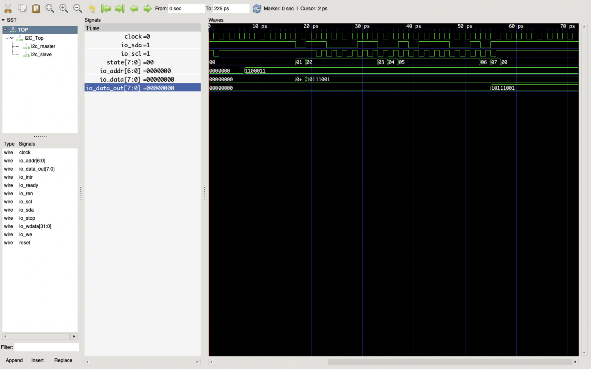

## I2C_CHISEL

I2C combines the best features of SPI and UARTs. With I2C, you can connect multiple slaves to a single master (like SPI) and you can have multiple masters controlling single, or multiple slaves. This is really useful when you want to have more than one microcontroller logging data to a single memory card or displaying text to a single LCD.

I2C is implemented in chisel and it has generic interface which can be easily attached with any System on Chip (SoC) by using [Jigsaw](https://github.com/Shahzaib2028/jigsaw) framework and it also depends upon [Caravan](https://github.com/merledu/caravan).

#### Jigsaw
Jigsaw aims to be a helpful utility that provides the designers with pre-made useful peripherals + other ip blocks that provides re-usability and agile development of System On Chips.

#### Caravan
Caravan intends to be equipped with a fully fledged API for easily creating open source bus protocols in Chisel based designs.

#### I2C Master Slave 

**Start Condition:** The SDA line switches from a high voltage level to a low voltage level before the SCL line switches from high to low.

**Stop Condition:** The SDA line switches from a low voltage level to a high voltage level after the SCL line switches from low to high.

**Address Frame:** A 7 or 10 bit sequence unique to each slave that identifies the slave when the master wants to talk to it.

**Read/Write Bit:** A single bit specifying whether the master is sending data to the slave (low voltage level) or requesting data from it (high voltage level)

**ACK/NACK Bit:** Each frame in a message is followed by an acknowledge/no-acknowledge bit. If an address frame or data frame was successfully received, an ACK bit is returned to the sender from the receiving device.

## FRAME

## OUTPUT

Testing I2C by Master writing data to slave

slave address = 1100011

data to write on slave = 10111001

io.data_out is the slave register on which data has been written succussfully.

